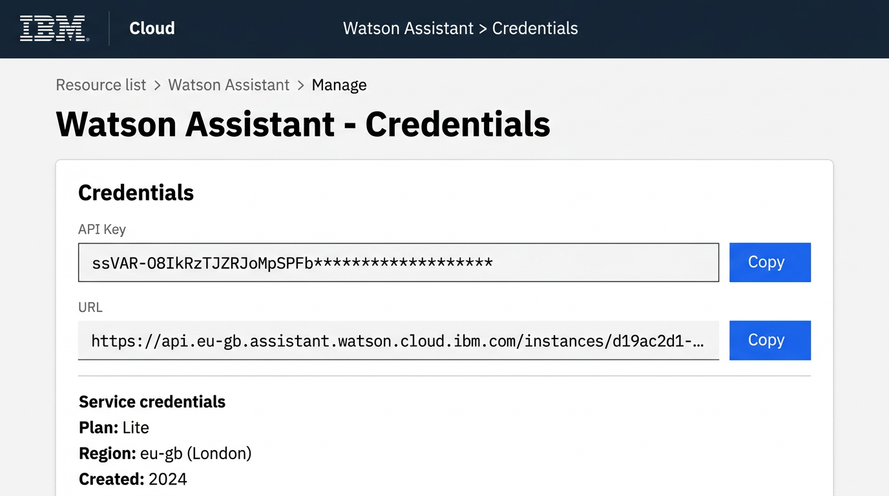
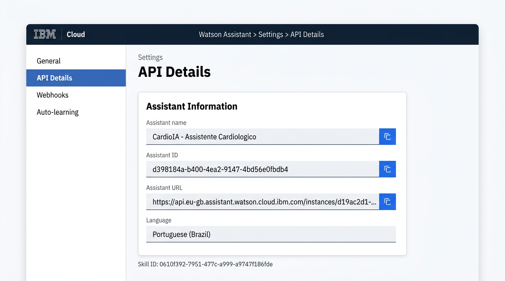
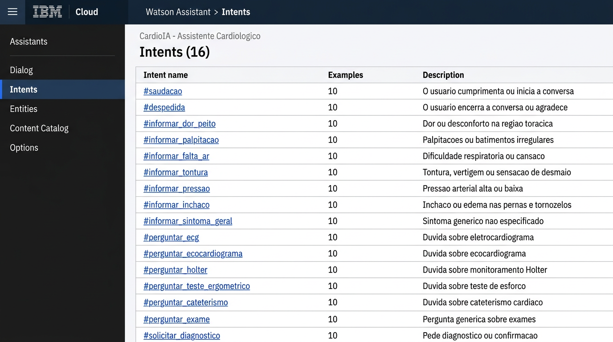
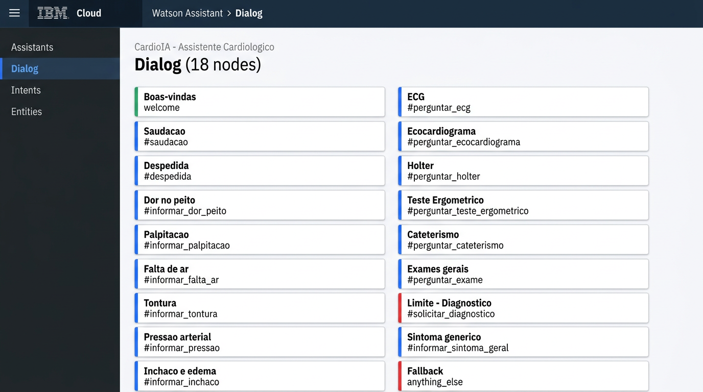

# Instrucoes de Configuracao - IBM Watson Assistant

> **Nota:** As imagens neste documento sao ilustracoes representativas do painel IBM Cloud. Para maior fidelidade, recomenda-se complementar com capturas de tela reais ao configurar o projeto.

## 1. Pre-requisitos

| Requisito             | Detalhes                                                    |
|-----------------------|-------------------------------------------------------------|
| Conta IBM Cloud       | Plano Lite (gratuito) e suficiente                          |
| Python                | Versao 3.10 ou superior                                     |
| pip                   | Gerenciador de pacotes Python                               |
| Navegador             | Chrome, Firefox, Edge ou Safari (versao recente)            |
| Acesso a internet     | Necessario para comunicacao com API Watson                  |

**Dependencias Python necessarias** (incluidas em `requirements.txt`):
```
flask
python-dotenv
ibm-watson>=8.0.0
ibm-cloud-sdk-core>=2.0.0
pytest
```

---

## 2. Criar o Servico Watson Assistant na IBM Cloud

1. Acesse [IBM Cloud](https://cloud.ibm.com/) e faca login (ou crie uma conta gratuita).
2. No catalogo de servicos, busque **"Watson Assistant"**.
3. Selecione o plano **Lite** (gratuito - inclui ate 1.000 usuarios unicos por mes).
4. Escolha a regiao mais proxima (ex: `eu-gb` para Europa, `us-south` para Americas).
5. Clique em **Create**.
6. Apos a criacao, acesse a pagina de **credenciais do servico**.
7. Anote os seguintes dados:

| Dado           | Onde encontrar                          | Exemplo                                                              |
|----------------|-----------------------------------------|----------------------------------------------------------------------|
| **API Key**    | Pagina de credenciais > API Key         | `ssVAR-O8IkRz...`                                                   |
| **URL**        | Pagina de credenciais > URL             | `https://api.eu-gb.assistant.watson.cloud.ibm.com/instances/xxxx`   |

**Figura 1 - Pagina de credenciais do Watson Assistant na IBM Cloud:**



---

## 3. Criar e Configurar o Assistente

1. No painel do Watson Assistant, clique em **Create assistant**.
2. Nomeie: `CardioIA - Assistente Cardiologico`.
3. Selecione idioma: **Portugues (Brasil)**.
4. Clique em **Create**.
5. Apos a criacao, acesse **Settings > API details**.
6. Copie o **Assistant ID** (formato: `d398184a-b400-...`).

**Figura 2 - Pagina API Details com o Assistant ID:**



---

## 4. Importar a Base de Conhecimento

Existem duas formas de importar a modelagem de intents, entities e dialog nodes.

### Opcao A - Via interface grafica (recomendada para iniciantes)

1. Dentro do assistente, va em **Dialog skill** > **Import skill**.
2. Selecione o arquivo `assistant/cardioia_assistant_export.json`.
3. Clique em **Import**.
4. Verifique se foram importados:
   - 16 intents com ~160 exemplos
   - 4 entities com sinonimos
   - 18 dialog nodes

**Figura 3 - Painel de Intents apos importacao (16 intents, 10 exemplos cada):**



**Figura 4 - Painel de Dialog Nodes apos importacao (18 nos de dialogo):**



### Opcao B - Via API (usado na integracao automatizada)

O backend do CardioIA pode importar automaticamente via API v1 do Watson:

```python
from ibm_watson import AssistantV1
from ibm_cloud_sdk_core.authenticators import IAMAuthenticator

authenticator = IAMAuthenticator('SUA_API_KEY')
assistant_v1 = AssistantV1(version='2021-11-27', authenticator=authenticator)
assistant_v1.set_service_url('SUA_URL')

# Carregar JSON
import json
with open('assistant/cardioia_assistant_export.json') as f:
    workspace_data = json.load(f)

# Importar (substitui conteudo existente)
assistant_v1.update_workspace(
    workspace_id='SEU_WORKSPACE_ID',
    intents=workspace_data['intents'],
    entities=workspace_data['entities'],
    dialog_nodes=workspace_data['dialog_nodes'],
    append=False
)
```

**Nota:** Apos a importacao, o Watson inicia o treinamento automaticamente. Aguarde aproximadamente 60 segundos antes de testar.

---

## 5. Configurar o Arquivo .env

Crie um arquivo `.env` na raiz do projeto com base no `.env.example`:

```env
FLASK_ENV=development
FLASK_DEBUG=true
PORT=5000
WATSON_API_KEY=sua_api_key_aqui
WATSON_URL=https://api.eu-gb.assistant.watson.cloud.ibm.com/instances/seu_instance_id
WATSON_ASSISTANT_ID=seu_assistant_id_aqui
WATSON_ASSISTANT_VERSION=2021-11-27
```

**Descricao das variaveis:**

| Variavel                     | Obrigatoria | Descricao                                          |
|------------------------------|-------------|-----------------------------------------------------|
| `FLASK_ENV`                  | Nao         | Ambiente Flask (development/production)              |
| `FLASK_DEBUG`                | Nao         | Ativa modo debug do Flask                            |
| `PORT`                       | Nao         | Porta do servidor (padrao: 5000)                     |
| `WATSON_API_KEY`             | Sim*        | Chave de autenticacao IAM do servico Watson          |
| `WATSON_URL`                 | Sim*        | URL base da instancia Watson Assistant               |
| `WATSON_ASSISTANT_ID`        | Sim*        | ID do assistente configurado                         |
| `WATSON_ASSISTANT_VERSION`   | Nao         | Versao da API (padrao: 2021-11-27)                   |

*Obrigatorias para modo Watson. Sem elas, o sistema opera em modo fallback local.

---

## 6. Iniciar o Backend

```bash
# Instalar dependencias
pip install -r requirements.txt

# Iniciar o servidor
python -m backend.app
```

A aplicacao estara disponivel em `http://localhost:5000`.

---

## 7. Verificar a Integracao

### 7.1 Healthcheck

Acesse via navegador ou curl:

```bash
curl http://localhost:5000/health
```

**Resposta esperada com Watson configurado:**

```json
{
  "status": "healthy",
  "watson_connected": true,
  "mode": "watson_assistant"
}
```

**Resposta em modo fallback (sem Watson):**

```json
{
  "status": "healthy",
  "watson_connected": false,
  "mode": "fallback_local"
}
```

### 7.2 Teste de mensagem

```bash
curl -X POST http://localhost:5000/api/chat \
  -H "Content-Type: application/json" \
  -d '{"message": "Oi, bom dia!"}'
```

**Resposta esperada:**

```json
{
  "response": "Ola! Sou o CardioIA, um assistente academico...",
  "intent": "saudacao",
  "confidence": 0.95,
  "source": "watson_assistant",
  "conversation_id": "abc123..."
}
```

Se o campo `source` for `"watson_assistant"`, a integracao esta funcionando corretamente.

---

## 8. Modo Fallback (Sem Watson)

Se as variaveis `WATSON_API_KEY`, `WATSON_URL` e `WATSON_ASSISTANT_ID` **nao estiverem configuradas** (ou o Watson estiver indisponivel), o sistema opera automaticamente em **modo fallback local**.

O modo fallback utiliza um motor de NLP baseado em correspondencia por palavras-chave com normalizacao de acentos. Todas as funcionalidades de classificacao de intents, reconhecimento de entities e respostas educacionais continuam disponiveis, porem sem a capacidade de aprendizado de maquina do Watson.

| Aspecto               | Modo Watson           | Modo Fallback         |
|------------------------|-----------------------|-----------------------|
| Classificacao          | Machine Learning      | Palavras-chave        |
| Confianca (confidence) | Valor real (0.0-1.0)  | Valor fixo (0.85)     |
| Sessao                 | Gerenciada pelo Watson| UUID local            |
| Regras de seguranca    | Ativas (pre-Watson)   | Ativas (identicas)    |
| Disponibilidade        | Depende de internet   | 100% offline          |

---

## 9. Troubleshooting (Resolucao de Problemas)

### Problema: Watson conecta mas retorna fallback

**Causa provavel:** O localStorage do navegador contem um `conversation_id` de sessao expirada.

**Solucao:** Clique no botao "Limpar conversa" na interface, ou execute no console do navegador:
```javascript
localStorage.removeItem('cardioia_conversation_id');
```

### Problema: Erro 401 (Unauthorized)

**Causa provavel:** API Key incorreta ou expirada.

**Solucao:** Verifique a `WATSON_API_KEY` no arquivo `.env`. Gere uma nova chave em IBM Cloud > Watson Assistant > Manage > Credentials.

### Problema: Erro 404 (Not Found)

**Causa provavel:** URL ou Assistant ID incorretos.

**Solucao:**
- Verifique se a `WATSON_URL` corresponde a regiao correta (ex: `eu-gb`, `us-south`).
- Verifique se o `WATSON_ASSISTANT_ID` esta correto em Settings > API details.

### Problema: SDK v11 exige environment_id

**Causa:** A versao 11+ do SDK `ibm-watson` alterou a assinatura dos metodos `create_session()` e `message()`, exigindo o parametro `environment_id` alem de `assistant_id`.

**Solucao implementada:** O CardioIA utiliza o `assistant_id` tambem como `environment_id`:
```python
session = assistant.create_session(
    assistant_id=assistant_id,
    environment_id=assistant_id
)
```

### Problema: Workspace com nodes duplicados na importacao

**Causa:** O Watson cria dialog nodes padrao que conflitam com os do JSON de importacao.

**Solucao:** Use `append=False` na importacao via API, ou delete os nodes padrao antes de importar pela interface.

### Problema: Watson demora para responder apos importacao

**Causa:** O Watson esta treinando o modelo apos a importacao de intents.

**Solucao:** Aguarde 30-60 segundos apos a importacao antes de testar. O treinamento ocorre automaticamente em background.

---

## 10. Execucao dos Testes Automatizados

```bash
pytest backend/tests -q
```

**Resultado esperado:**
```
30 passed in X.XXs
```

Os testes validam:
- Healthcheck (4 testes)
- Endpoint de chat com mensagens validas, invalidas e de urgencia (14 testes)
- Regras de seguranca com palavras individuais, combinacoes e acentos (12 testes)
